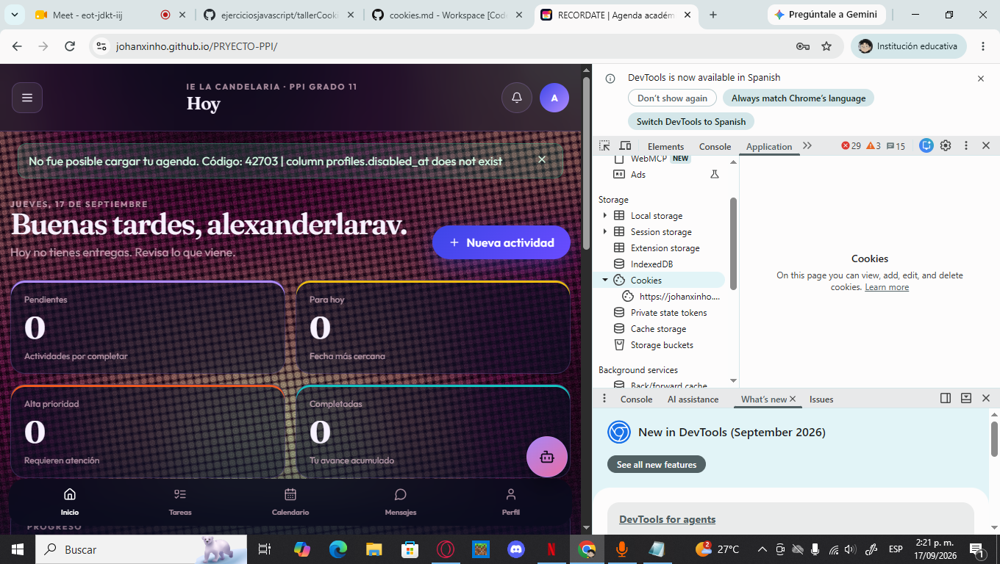
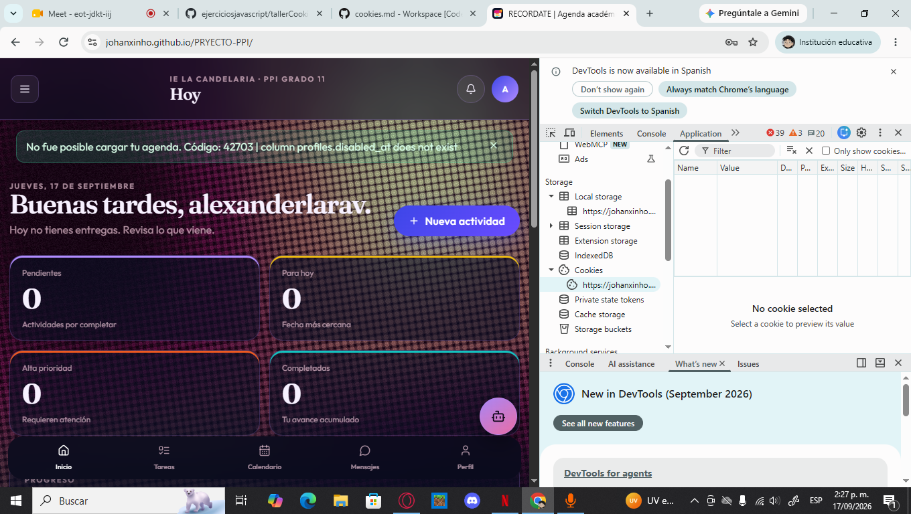
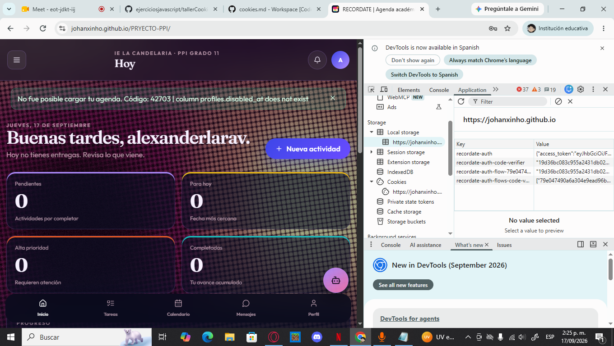

Parte 1 — Investigación y conceptos
1. ¿Qué es una cookie?

Una cookie es un pequeño dato que un sitio web guarda en el navegador del usuario. Normalmente contiene información en formato de nombre y valor, por ejemplo:

tema=oscuro

El navegador puede enviar automáticamente esa cookie al servidor cuando realiza una petición que coincide con el dominio y las reglas de la cookie.

Las cookies son útiles para mantener sesiones, guardar algunas preferencias y reconocer determinadas configuraciones del usuario.

Comparación
Característica	Cookie	localStorage	sessionStorage
Se envía automáticamente al servidor	Sí, si coincide con dominio/path y reglas	No	No
Permanece después de cerrar el navegador	Depende de su expiración	Sí	No, normalmente termina al cerrar la pestaña
Tiene expiración configurable	Sí	No directamente	No directamente
Tamaño aproximado	Unos pocos KB por cookie	Varios MB, depende del navegador	Varios MB, depende del navegador
JavaScript puede acceder	Sí, excepto HttpOnly	Sí	Sí
¿Por qué existen las cookies?

HTTP es un protocolo que, por sí mismo, no recuerda las peticiones anteriores. Es decir, cada petición HTTP es independiente.

Las cookies ayudan a que una aplicación pueda conservar información entre diferentes peticiones. Por ejemplo, después de iniciar sesión, el servidor puede utilizar una cookie para identificar la sesión del usuario.

2. ¿Cómo se crea una cookie?

Cuando una respuesta HTTP quiere crear una cookie, el servidor puede enviar una cabecera como:

Set-Cookie: tema=oscuro; Path=/; Max-Age=3600

El navegador guarda la cookie.

Después, cuando corresponde enviar esa cookie, el navegador puede mandar:

Cookie: tema=oscuro
Crear una cookie desde JavaScript

También podemos crear una cookie utilizando:

document.cookie = "tema=oscuro; path=/; max-age=3600";

Para consultar las cookies accesibles desde JavaScript:

console.log(document.cookie);

Sin embargo, document.cookie es una API bastante limitada. No muestra las cookies que tengan HttpOnly y para modificar o eliminar una cookie debemos respetar sus atributos, especialmente Path y, cuando corresponda, Domain.

3. Atributos importantes de una cookie
Expires y Max-Age

Estos atributos indican cuánto tiempo puede existir una cookie.

Ejemplo:

Set-Cookie: tema=oscuro; Max-Age=3600

Max-Age=3600 significa aproximadamente una hora.

También se puede utilizar Expires con una fecha específica.

Si no se indica ninguno, normalmente se trata de una cookie de sesión.

Domain y Path

Domain indica para qué dominio puede enviarse la cookie.

Si no se especifica Domain, la cookie queda asociada al host que la creó y funciona como una cookie host-only.

Por ejemplo:

Set-Cookie: usuario=alex; Path=/

El atributo Path determina en qué rutas del sitio se puede enviar la cookie.

Path=/

permite que esté disponible para las rutas del sitio que correspondan a ese dominio.

Secure

Una cookie con:

Secure

solo debe enviarse mediante una conexión HTTPS, salvo excepciones especiales de entornos locales.

Esto ayuda a evitar que una cookie sensible sea enviada por una conexión HTTP sin cifrado.

HttpOnly

Una cookie con:

HttpOnly

no puede ser leída mediante JavaScript usando document.cookie.

Esto es útil para cookies que contienen identificadores de sesión porque dificulta que un script ejecutado en la página pueda leer directamente ese valor.

No significa que HttpOnly elimine todos los riesgos de XSS, pero reduce una de las consecuencias posibles de un ataque XSS: el robo directo del valor de la cookie.

SameSite

SameSite controla cuándo una cookie puede enviarse en solicitudes relacionadas con otros sitios.

Sus valores principales son:

Strict
SameSite=Strict

Es la opción más restrictiva. La cookie no se envía en solicitudes cross-site normales.

Lax
SameSite=Lax

Permite ciertos casos de navegación de nivel superior, principalmente navegaciones seguras como enlaces GET, pero restringe otros tipos de solicitudes cross-site.

None
SameSite=None; Secure

Permite el uso cross-site, pero los navegadores requieren Secure.

Un ejemplo donde puede ser necesario SameSite=None es cuando una cookie debe utilizarse en un contexto realmente cross-site, como determinados recursos o servicios embebidos.

Partitioned

Partitioned está relacionado con CHIPS (Cookies Having Independent Partitioned State).

La idea es permitir determinadas cookies de terceros, pero separando su almacenamiento por el sitio donde se utilizan.

Esto reduce la posibilidad de que una misma cookie de terceros sea utilizada para seguir al usuario de manera global entre diferentes sitios.

4. Cookies de primera y tercera parte
First-party cookies

Son cookies relacionadas directamente con el sitio que el usuario está visitando.

Por ejemplo, si estamos en:

https://mi-sitio.com

una cookie utilizada por ese mismo sitio puede considerarse first-party.

Pueden utilizarse para:

Mantener una sesión.
Recordar preferencias.
Guardar configuraciones.
Mantener un carrito de compras.
Third-party cookies

Son cookies asociadas con otro dominio diferente al sitio principal que el usuario está visitando.

Un ejemplo legítimo podría ser un servicio externo integrado en una página.

También se han utilizado para publicidad y seguimiento entre diferentes sitios.

¿Por qué los navegadores las bloquean?

Los navegadores han aumentado las restricciones sobre cookies de terceros debido a problemas de privacidad y seguimiento.

Bloquearlas puede reducir la capacidad de diferentes empresas para construir perfiles de navegación entre sitios.

5. Cookies y sesiones de autenticación

Una forma tradicional de manejar una sesión es que el servidor cree una sesión y entregue al navegador una cookie que contiene un identificador.

Por ejemplo:

session_id=abc123

El servidor guarda la información de la sesión y utiliza ese identificador para saber qué usuario está conectado.

La cookie no necesariamente contiene toda la información del usuario.

Cookie de sesión vs JWT

Una sesión tradicional normalmente funciona así:

Navegador
   ↓
Cookie con ID
   ↓
Servidor
   ↓
Busca la sesión
   ↓
Identifica al usuario

Con JWT, el token contiene información firmada que puede ser utilizada para validar la autenticación.

Un JWT puede almacenarse en diferentes lugares:

Cookie.
localStorage.
Memoria de la aplicación.
¿Por qué importa dónde se guarda?

Si un token se almacena en localStorage, JavaScript puede leerlo.

Por eso, si existe una vulnerabilidad XSS, un script malicioso podría intentar acceder a ese token.

Una cookie HttpOnly, en cambio, no puede ser leída directamente por JavaScript.

Sin embargo, las cookies se envían automáticamente en determinadas solicitudes, por lo que también hay que considerar el riesgo de CSRF.

Refresh token

Un refresh token permite obtener nuevos tokens de acceso cuando el anterior caduca.

Por ser un elemento importante para mantener la sesión, debe protegerse cuidadosamente.

Si se utiliza una arquitectura basada en cookies, pueden aplicarse medidas como:

HttpOnly.
Secure.
SameSite.
Protección CSRF.
Expiración adecuada.
6. Seguridad
XSS

XSS significa Cross-Site Scripting.

Ocurre cuando contenido controlado por un usuario termina siendo interpretado como código ejecutable en una página web.

Una medida útil es utilizar cookies HttpOnly para información sensible que no necesita ser accesible desde JavaScript.

También es importante:

Validar entradas.
Escapar correctamente el contenido.
Evitar insertar HTML no confiable.
Utilizar una política CSP cuando sea apropiado.
CSRF

CSRF significa Cross-Site Request Forgery.

La idea básica es que un sitio malicioso puede intentar provocar una solicitud hacia otro sitio donde el usuario ya tiene una sesión iniciada.

Como las cookies pueden enviarse automáticamente, una aplicación que dependa solamente de la cookie debe tener medidas adicionales.

Ejemplo conceptual

El siguiente ejemplo es únicamente educativo y no apunta a ningún sitio real:

<!-- EJEMPLO CONCEPTUAL. NO EJECUTAR CONTRA SERVICIOS REALES. -->

<form action="#" method="POST">
  <input type="hidden" name="monto" value="100">
  <input type="hidden" name="destino" value="cuenta-ejemplo">
  <button type="submit">
    Ejemplo conceptual
  </button>
</form>

Si existiera un endpoint vulnerable como:

/api/transferir-dinero

y confiara únicamente en una cookie de sesión sin comprobar un token CSRF u otra protección, el navegador podría incluir automáticamente la cookie en determinadas circunstancias.

Por eso una aplicación real debe implementar controles apropiados.

¿Strict o Lax?

SameSite=Strict aplica una restricción más fuerte a las solicitudes cross-site.

SameSite=Lax también ayuda contra muchos escenarios de CSRF, aunque permite algunos casos de navegación de nivel superior.

Para operaciones sensibles, SameSite debe considerarse una capa de protección y no necesariamente el único mecanismo. También pueden utilizarse tokens CSRF y otras medidas del servidor.

7. Privacidad y normas

Las cookies también tienen relación con la privacidad porque pueden almacenar identificadores y datos relacionados con la actividad del usuario.

En Europa, el GDPR establece reglas sobre el tratamiento de datos personales y el consentimiento. Para cookies que no sean estrictamente necesarias, normalmente se requiere informar adecuadamente y obtener consentimiento cuando corresponda.

En Colombia, la protección de datos personales está relacionada, entre otras normas, con la Ley 1581 de 2012 y sus reglamentaciones.

No significa que absolutamente todas las cookies necesiten el mismo tipo de consentimiento. Las cookies estrictamente necesarias para que un servicio funcione reciben un tratamiento diferente de las utilizadas para analítica, publicidad o seguimiento.

¿Qué debería tener un administrador de cookies?

Un sistema de consentimiento debería:

Explicar qué tipos de cookies se utilizan.
Indicar para qué se utilizan.
Diferenciar cookies necesarias de otras categorías.
Permitir aceptar o rechazar las categorías que correspondan.
Permitir cambiar la decisión posteriormente cuando sea aplicable.
Proporcionar información sobre privacidad.
8. Cookies y Supabase

En una aplicación React que utiliza Supabase Auth, la sesión puede mantenerse utilizando el almacenamiento del navegador.

La configuración habitual del cliente de Supabase utiliza almacenamiento persistente del navegador, como localStorage, aunque la aplicación puede utilizar una estrategia diferente.

En aplicaciones con renderizado del lado del servidor, Supabase proporciona herramientas como @supabase/ssr para trabajar con sesiones mediante cookies.

Por eso es importante revisar el proyecto real y no asumir que siempre existe una cookie de autenticación.

¿Dónde revisar el token?

En Chrome se puede abrir:

DevTools → Application

y revisar:

Local Storage

y:

Cookies

Si el proyecto utiliza localStorage, el token o los datos de sesión pueden aparecer allí.

Si utiliza cookies, se deben revisar sus atributos:

HttpOnly
Secure
SameSite
Domain
Path
Expires
Supabase y GitHub Pages

Cuando una aplicación publicada en GitHub Pages realiza peticiones a Supabase, se debe considerar CORS.

El servidor debe permitir el origen correspondiente. Conceptualmente, una respuesta HTTP puede incluir:

Access-Control-Allow-Origin: https://tuusuario.github.io

El origen debe corresponder al dominio real de la aplicación.

No se debe confundir CORS con autenticación: CORS controla desde qué orígenes puede realizarse una solicitud desde el navegador, mientras que la autenticación determina quién tiene acceso al recurso.

9. Revisar cookies con DevTools

En Chrome:

F12 → Application → Storage → Cookies

En Firefox se puede utilizar:

F12 → Storage → Cookies

Entre las columnas que podemos encontrar están:

Name
Value
Domain
Path
Expires
Size
HttpOnly
Secure
SameSite

Desde DevTools también podemos eliminar una cookie específica para comprobar qué sucede en la aplicación.

Parte 2 — Práctica
A. Inspeccionar cookies reales

Primero se debe abrir el sitio publicado o la aplicación utilizada en el proyecto.

Después:

F12
↓
Application
↓
Cookies

Se debe buscar una cookie y observar:

Nombre.
Valor.
Dominio.
Path.
Fecha de expiración.
HttpOnly.
Secure.
SameSite.

¿Es una cookie de sesión o tiene expiración fija?

Esto se puede determinar revisando la columna Expires.

Si no tiene una fecha de expiración persistente, puede tratarse de una cookie de sesión.

Si aparece una fecha concreta, tiene una expiración establecida.

¿Tiene HttpOnly?

Hay que mirar la columna HttpOnly.

Si está marcada, JavaScript no debería poder leer directamente esa cookie mediante document.cookie.

Probar document.cookie

En la consola del navegador:

console.log(document.cookie);

El resultado muestra las cookies que JavaScript tiene permitido consultar.

Las cookies HttpOnly no aparecen.

B. Crear y borrar una cookie con JavaScript

Código utilizado:

document.cookie = "tema=oscuro; path=/; max-age=3600";

console.log(document.cookie);

document.cookie = "tema=; path=/; max-age=0";

console.log(document.cookie);
Explicación

La primera línea crea una cookie llamada tema con el valor oscuro.

document.cookie = "tema=oscuro; path=/; max-age=3600";

max-age=3600 indica que la cookie tendrá una duración aproximada de una hora.

Después:

console.log(document.cookie);

permite comprobar que JavaScript puede verla.

Para eliminarla:

document.cookie = "tema=; path=/; max-age=0";

Se utiliza max-age=0 para indicar que debe expirar inmediatamente.

¿Por qué no se puede hacer document.cookie="" para borrar todo?

Porque document.cookie no funciona como una variable que contiene todas las cookies.

Para eliminar una cookie hay que modificar esa cookie específica y utilizar los atributos correspondientes.

Además, normalmente debemos utilizar el mismo Path con el que fue creada. Si la cookie fue creada con:

Path=/

debemos utilizar también:

Path=/

al eliminarla.

C. Helper de cookies para React

Se puede crear el archivo:

src/utils/cookies.js

Código:

/**
 * Crea o actualiza una cookie.
 *
 * @param {string} nombre Nombre de la cookie.
 * @param {string} valor Valor que se quiere guardar.
 * @param {number} diasExpiracion Cantidad de días antes de que expire.
 * @param {Object} opciones Opciones adicionales de la cookie.
 * @param {string} [opciones.path="/"] Ruta donde estará disponible.
 * @param {boolean} [opciones.secure=false] Envía la cookie solo mediante HTTPS.
 * @param {"Strict"|"Lax"|"None"} [opciones.sameSite="Lax"] Política SameSite.
 */
export function setCookie(
  nombre,
  valor,
  diasExpiracion,
  opciones = {}
) {
  const {
    path = "/",
    secure = false,
    sameSite = "Lax",
  } = opciones;

  const fecha = new Date();

  fecha.setTime(
    fecha.getTime() +
      diasExpiracion * 24 * 60 * 60 * 1000
  );

  const cookie = [
    `${encodeURIComponent(nombre)}=${encodeURIComponent(valor)}`,
    `expires=${fecha.toUTCString()}`,
    `path=${path}`,
    `SameSite=${sameSite}`,
    secure ? "Secure" : "",
  ]
    .filter(Boolean)
    .join("; ");

  document.cookie = cookie;
}

/**
 * Obtiene el valor de una cookie.
 *
 * @param {string} nombre Nombre de la cookie.
 * @returns {string|null} Valor de la cookie o null si no existe.
 */
export function getCookie(nombre) {
  const nombreBuscado =
    `${encodeURIComponent(nombre)}=`;

  const cookies = document.cookie.split(";");

  for (const cookie of cookies) {
    const cookieLimpia = cookie.trim();

    if (cookieLimpia.startsWith(nombreBuscado)) {
      return decodeURIComponent(
        cookieLimpia.substring(nombreBuscado.length)
      );
    }
  }

  return null;
}

/**
 * Elimina una cookie.
 *
 * @param {string} nombre Nombre de la cookie.
 * @param {Object} opciones Opciones de la cookie.
 */
export function deleteCookie(nombre, opciones = {}) {
  setCookie(nombre, "", -1, opciones);
}
Usar el helper para guardar el tema

Por ejemplo, en un componente React:

import { useState } from "react";
import {
  setCookie,
  getCookie,
  deleteCookie,
} from "./utils/cookies";

function Tema() {
  const [tema, setTema] = useState(
    getCookie("tema") || "claro"
  );

  function cambiarTema() {
    const nuevoTema =
      tema === "claro" ? "oscuro" : "claro";

    setTema(nuevoTema);

    setCookie("tema", nuevoTema, 30, {
      path: "/",
      secure: window.location.protocol === "https:",
      sameSite: "Lax",
    });
  }

  function borrarTema() {
    deleteCookie("tema", {
      path: "/",
      sameSite: "Lax",
    });

    setTema("claro");
  }

  return (
    

      
Tema actual: {tema}

      <button onClick={cambiarTema}>
        Cambiar tema
      </button>

      <button onClick={borrarTema}>
        Borrar tema
      </button>
    

  );
}

export default Tema;
¿Qué hace este código?

Primero intenta recuperar la cookie:

getCookie("tema")

Si existe, utiliza ese valor.

Si no existe, comienza con:

claro

Cuando se cambia el tema se utiliza:

setCookie(...)

para guardar la nueva configuración.

Cuando se pulsa el botón de borrar se utiliza:

deleteCookie(...)

para eliminar la cookie.

D. Análisis de CSRF

Un ataque CSRF aprovecha principalmente el hecho de que el navegador puede enviar automáticamente las cookies correspondientes a un sitio.

Un escenario hipotético sería:

El usuario tiene una sesión iniciada.
La sesión se identifica mediante una cookie.
El servidor tiene una operación sensible, por ejemplo:
/api/transferir-dinero
El servidor no comprueba un token CSRF.
Un sitio externo intenta provocar una solicitud.
Dependiendo de las políticas de cookies y del contexto, el navegador podría enviar la cookie.
El servidor podría interpretar la solicitud como perteneciente al usuario.

Por eso las aplicaciones deben utilizar medidas de protección adecuadas.

Diferencia entre Strict y Lax

SameSite=Strict es más restrictivo y evita que la cookie se envíe en muchos escenarios cross-site.

SameSite=Lax permite determinados casos de navegación de nivel superior, por lo que es menos restrictivo.

Para acciones sensibles se pueden utilizar además:

Tokens CSRF.
Comprobaciones de origen.
SameSite.
Validaciones en el servidor.
E. Auditoría del proyecto

Para revisar el proyecto se debe comprobar dónde guarda Supabase la información de autenticación.

Paso 1

Abrir:

F12 → Application
Paso 2

Revisar:

Local Storage

y:

Cookies
Paso 3

Buscar información relacionada con la sesión de Supabase.

Resultado

Al revisar mi proyecto después de iniciar sesión, encontré que la información de autenticación de Supabase se está guardando en el Local Storage del navegador. Aparece una clave llamada recordate-auth que contiene información de la sesión, incluyendo un access_token. También aparecen otras claves relacionadas con el proceso de autenticación. En la sección de Cookies no encontré una cookie de autenticación de mi proyecto.

¿Qué pasaría si hubiera XSS?

Si un token sensible estuviera disponible para JavaScript, una vulnerabilidad XSS podría permitir que código no confiable intentara acceder a ese token.

Algunas medidas para reducir este riesgo son:

Validar y sanitizar entradas.
Evitar insertar HTML no confiable.
Utilizar mecanismos seguros de renderizado.
Implementar CSP cuando corresponda.
Reducir la exposición de tokens en JavaScript.
Utilizar cookies HttpOnly cuando la arquitectura de la aplicación lo permita.
Resumen final
Tema	¿Qué aprendí?	¿Lo usa mi proyecto?
Secure	Hace que la cookie se envíe mediante HTTPS en condiciones normales.	Verificar en DevTools
HttpOnly	Impide que JavaScript lea directamente la cookie.	Verificar en DevTools
SameSite	Controla el envío de cookies en contextos relacionados con otros sitios.	Verificar en DevTools
Cookies de terceros	Son cookies asociadas a un dominio diferente al sitio principal.	Verificar si existen
Banner de consentimiento	Sirve para informar y gestionar el consentimiento cuando corresponda.	Verificar si el proyecto tiene uno
Token de Supabase	La ubicación depende de la configuración y arquitectura del proyecto.	Revisar Local Storage y Cookies